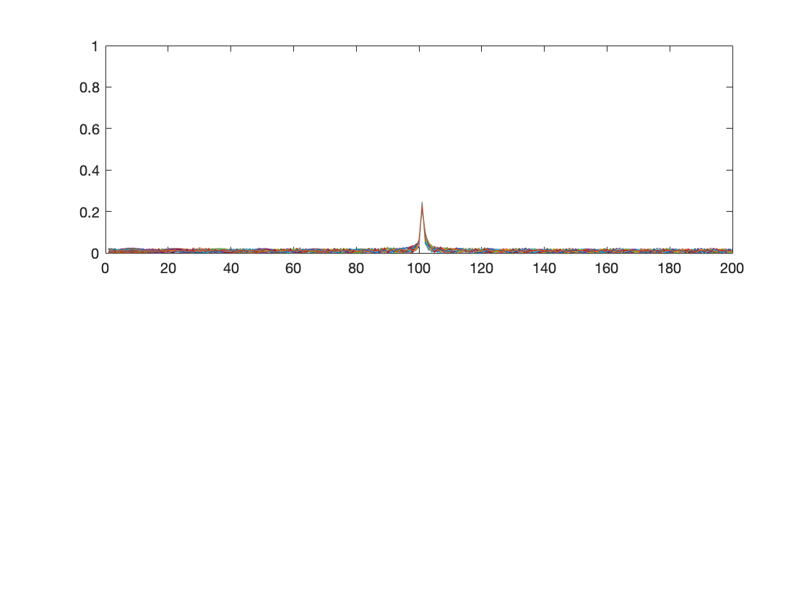
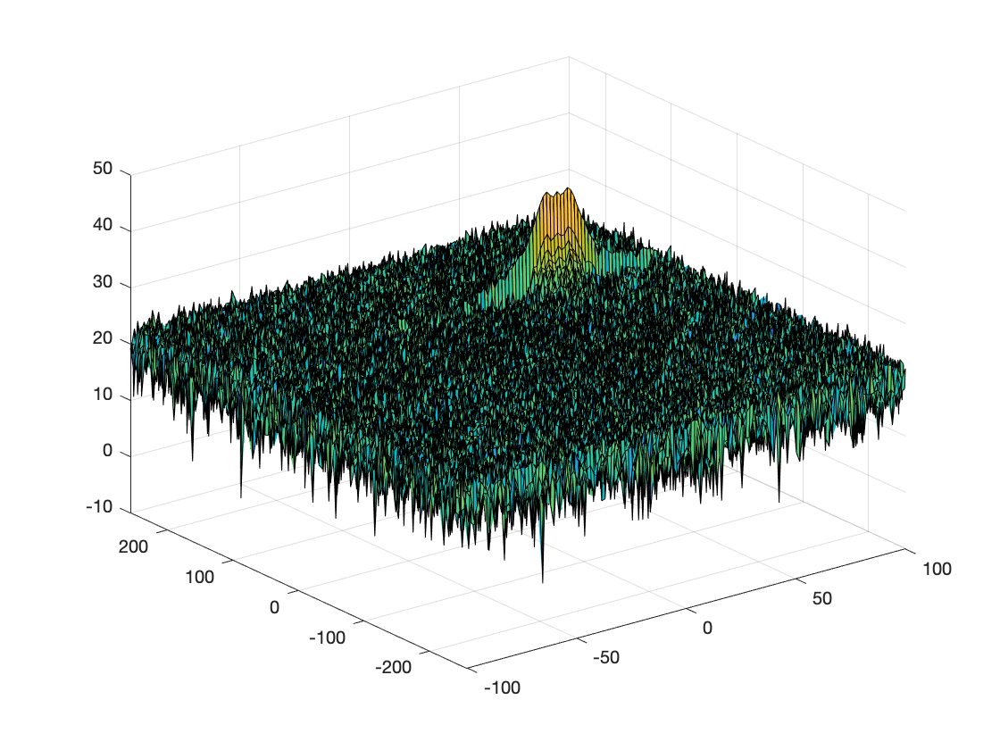
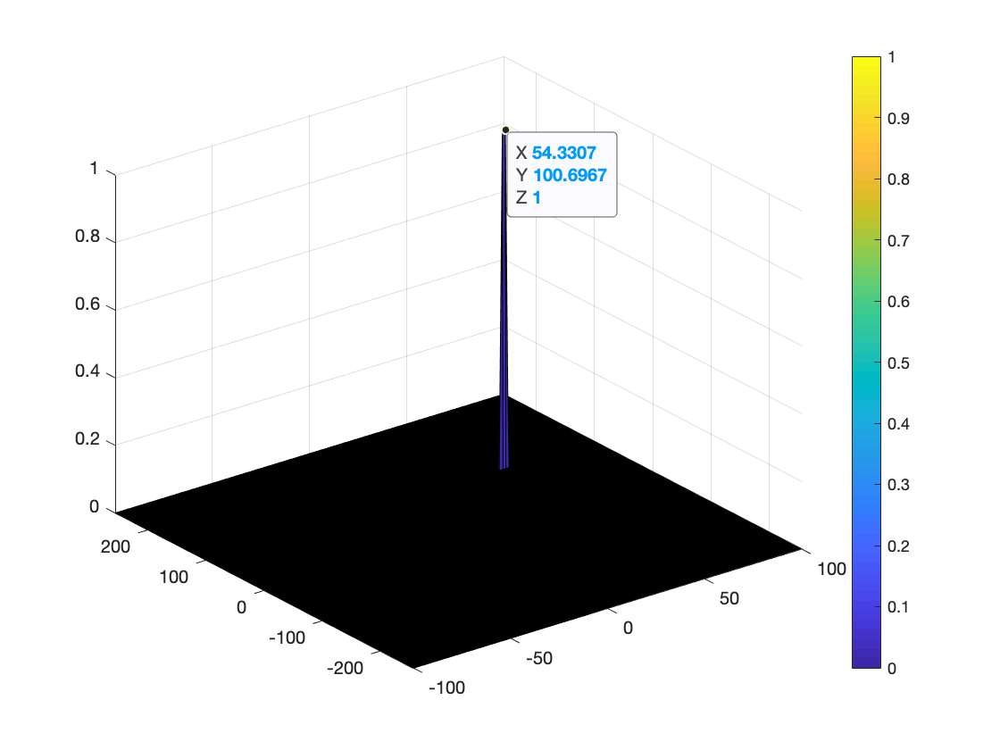

# SFND - Udacity - Radar Target Generation and Detection

Here's my solution to the "Radar Project" from the Udacity's Sensor Fusion Nanodegree.

## 1 - Basic setting
In this project, we simulate a radar with the following specifications:
- Frequency of operation: 77 GHz
```matlab
Frequency_of_operation = 77e9;
```

- Max Range: 200m
```matlab
MaxRange = 200;
```

- Range Resolution: 1m
```matlab
RangeResolution = 1;
```

- Max Velocity: 100m/s
```matlab
MaxVelocity = 100;
```

- Velocity Resolution: 1m/s
```matlab
VelResolution = 1;
```

- Speed of light: 300 000 000 m/s
```matlab
c = 3e8;
```

## 2 - FMCW Waveform Generation
We generate FMCW waveform with the following specs

- Bandwidth
 ```matlab
Bandwidth = c/(2*VelResolution);
 ```

- Chirp time
 ```matlab
 Tchirp = 5.5*2*MaxRange/c;
 ```

- Slope
 ```matlab
 Slope = Bandwidth/Tchirp;
 ```


 The number of chirps in one sequence is 128 and the number of samples per chirp is 1024.
 ```matlab
 N_doppler=128;
 N_range=1024;
 ```

 That gives us a total amount of time samples.
 ```matlab
time=linspace(0,N_doppler*Tchirp,N_range*N_doppler);
 ```

As an example we set the target's initial position and velocity as 100m and 50 m/s, respectively. More over, we assume that its velocity remains constant.
```matlab
target_initial_position = 100;
target_velocity = 50;
```

## 3 - Generating the signals

We can generate the transmitted signal as follows
```matlab
Transmitted_signal=cos(2*pi*(Frequence_of_operation*time+Slope*time.^2/2));
```

Moreover, since we are assuming that the target moves with constant velocity we know that the range and the time delay are given by
```matlab
Range_t = target_initial_position + target_velocity*time;
TimeDelay = 2*Range_t/c
```

Hence, we can obtain the Received signal and calculate the Mixed signal
```matlab
Received_signal=cos(2*pi*(Frequence_of_operation*(time-TimeDelay)+Slope*(time-TimeDelay).^2/2));
Mixed_signal = Transmitted_signal.*Received_signal;
```

## 4 - Range Measurement

With the (discrete) Fourier Transform we can get the range of the target.
**FFT(Fast Fourier Transform)** is an optimized algorithm that reduces the running time to n log(n). To this end, we reshape the mixed signal as a `N_range x N_doppler` matrix, apply the `fft` function and normalize.
```matlab
Mixed_signal = reshape(Mixed_signal,[N_range,N_doppler]) ;
fft_beat = fft(Mixed_signal, N_range,1 )/N_range;
```

The `fft` gives us double signed signal containing complex numbers. Hence we take the absolute value and the firs half only.
```matlab
fft_beat_abs = abs(fft_beat);
fft_beat_abs_first_half = fft_beat_abs(1:N_range/2);
```

Finally, we plot the result.

```matlab
figure ('Name','Range from First FFT')
subplot(2,1,1)
plot(fft_beat_abs_first_half)
axis ([0 200 0 1]); % rescale so that we get the range!
```


From the picture above we see that a target was detected at around 100 m, which makes sense since that's the position we put the target.

## 5 - Range Doppler Response

If we apply the `fft` in the other dimension(1 is default!) we get the velocity. However, since we want both, we can apply the `fft2` function which gives us the response in both range and doppler bins.
```matlab
sig_fft2 = fft2(Mixed_signal,N_range,N_doppler);
sig_fft2 = sig_fft2(1:N_range/2,1:N_doppler);
sig_fft2 = fftshift (sig_fft2);
RadarDopplerMap = abs(sig_fft2);
RadarDopplerMap = 10*log10(RadarDopplerMap)  % Convert to DB
doppler_axis = linspace(-100,100,N_doppler);
range_axis = linspace(-200,200,N_range/2)*((N_range/2)/400);
figure,surf(doppler_axis,range_axis,RadarDopplerMap);
```



## 6 - CFAR

As we can see from the previous picture, there's a lot of noise in the mixed signal. One well known way to remove this is by applying a **c**ell-**a**veraging **c**onstant **f**alse **a**larm **r**ate **f**ilter([CA-CFAR](https://en.wikipedia.org/wiki/Constant_false_alarm_rate)).

In short, the idea is to slide a 2D window made of:
- training cells: cells used to get an average value
- guard cells: cells used to "protect" the target cell
- target/cut cell:  cell to be filtered.

through the entire `RangeDopplerMap` and an `Offset` value as a binary filter.


Here's how I implemented it:

1. I start by defining the number of training and guard cells as well as the offset value.
```matlab
N_Training_cell_Range = 8; % Number of training cells range
N_Training_cell_Doppler = 8; % Number of training cells doppler
N_Guard_cell_Range = 2; % Number of guard cells range
N_Guard_cell_Doppler = 2; % Number of guard cells doppler
Offset=1.7;
```
Those parameters must be determined through a trial and error approach.

2. Slide the window through the entire `RangeDopplerMap`, get the noise level, and apply a binary filter.
```matlab
for i = 1:(length(RadarDopplerMap)-(2*N_Guard_cell_Range+2*N_Training_cell_Range+1))
    for j = 1:(N_doppler-(2*N_Guard_cell_Doppler+2*N_Training_cell_Doppler+1))
        % Use RDM[x,y] as the matrix from the output of 2D FFT for implementing
        % CFAR
        Noise_Level = get_training_mean(RadarDopplerMap(i:i-1+2*N_Guard_cell_Range+2*N_Training_cell_Range+1,j:j-1+2*N_Guard_cell_Doppler+2*N_Training_cell_Doppler+1),N_Training_cell_Range,N_Training_cell_Doppler,N_Guard_cell_Range,N_Guard_cell_Doppler);
        threshold = Noise_Level*Offset;
        if (RadarDopplerMap(i+N_Training_cell_Range+N_Guard_cell_Range, j+N_Training_cell_Doppler+N_Guard_cell_Doppler) < threshold)
            RadarDopplerMap(i+N_Training_cell_Range+N_Guard_cell_Range, j+N_Training_cell_Doppler+N_Guard_cell_Doppler) = 0;
        else
            RadarDopplerMap(i+N_Training_cell_Range+N_Guard_cell_Range, j+N_Training_cell_Doppler+N_Guard_cell_Doppler) = 1;
        end    
    end
   end
```

The helper function `get_training_mean` accepts as arguments the :
```matlab
function [meanValue] = get_training_mean(data, Tr, Td, Gr, Gd)
%GET_TRAINING_MEAN Returns the mean value over all training cells
%
% Arguments:
% data: matrix of size (2*Tr + 2*Gr+1)x(2*Td + 2*Gd+1) from which we want to extract the mean from the training cells.
% Tr: number of training cells (on each side) in the range direction.
% Td: number of training cells (on each side) in the doppler direction
% Gr: number of guard cells (on each side) in the range direction.
% Gd: number of guard cells (on each side) in the doppler direction

data = db2pow(data); % the matrix has values in DB, hence we get to convert it
filter = ones(2*Tr + 2*Gr + 1, 2*Td + 2*Gd + 1); % we create a filter with the same size as data
filter(Tr+1:(Tr+2*Gr+1), Td+1:(Td+2*Gd+1)) = 0; % and set to zero the values we don't want to: guard cells and cut
meanValue = pow2db(mean(filter.*data,'all')); % We get the mean and convert to DB the result
end
```
The process above will generate a thresholded block, which is smaller than the Range Doppler Map since the CUT cannot be located at the edges of matrix which means that a few cells will not be thresholded. To keep the map size set those values to 0.

```matlab
RadarDopplerMap(1:N_Training_cell_Range+N_Guard_cell_Range,:) = 0;
RadarDopplerMap(end-N_Training_cell_Range-N_Guard_cell_Range:end,:)= 0;
RadarDopplerMap(N_Training_cell_Range+N_Guard_cell_Range+1:end-(N_Training_cell_Range+N_Guard_cell_Range),1:N_Training_cell_Doppler+N_Guard_cell_Doppler) = 0;
RadarDopplerMap(N_Training_cell_Range+N_Guard_cell_Range+1:end-(N_Training_cell_Range+N_Guard_cell_Range),end-N_Training_cell_Doppler-N_Guard_cell_Doppler:end)= 0;
```

As a result, we get the following output image image. Notice that the velocity(X) and the range(Y) match with the ones we set previously with a small error.

